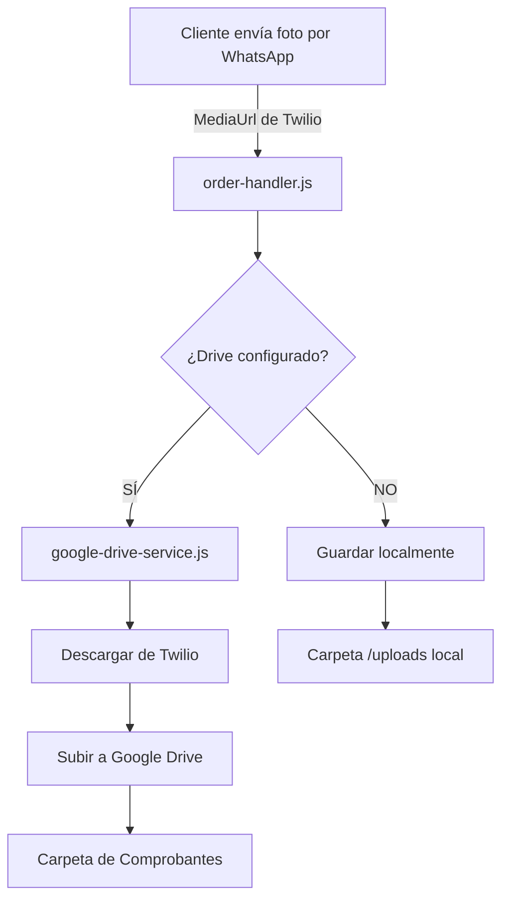

# 📁 CONFIGURACIÓN DE GOOGLE DRIVE PARA COMPROBANTES

## 🎯 PROBLEMA IDENTIFICADO
Las imágenes de comprobantes se están quedando en Twilio y no se están subiendo a Google Drive.

## ✅ SOLUCIÓN IMPLEMENTADA

### 1. **Variables de Entorno Agregadas**
He agregado las siguientes líneas al archivo `.env`:

```env
# Google Drive Configuration
DRIVE_ENABLED=TRUE
DRIVE_FOLDER_ID=TU_ID_DE_CARPETA_AQUI
```

### 2. **PASOS PARA ACTIVAR GOOGLE DRIVE**

#### Paso 1: Crear Carpeta en Google Drive
1. Ve a [Google Drive](https://drive.google.com)
2. Inicia sesión con la misma cuenta que usaste para crear el Service Account
3. Crea una nueva carpeta llamada "Comprobantes_CafeBot" (o el nombre que prefieras)
4. Haz clic derecho en la carpeta → "Compartir"
5. Agrega el email del Service Account: `cafe-bot@maximal-journey-459103-k4.iam.gserviceaccount.com`
6. Dale permisos de "Editor"

#### Paso 2: Obtener el ID de la Carpeta
1. Abre la carpeta en Google Drive
2. Mira la URL en tu navegador:
   ```
   https://drive.google.com/drive/folders/1ABC123def456GHI789jkl
   ```
3. El ID es la parte después de `/folders/`: `1ABC123def456GHI789jkl`

#### Paso 3: Actualizar el Archivo .env
1. Abre el archivo `.env` en tu proyecto
2. Reemplaza `TU_ID_DE_CARPETA_AQUI` con el ID real:
   ```env
   DRIVE_FOLDER_ID=1ABC123def456GHI789jkl
   ```

#### Paso 4: Reiniciar el Bot
```bash
# Si está corriendo localmente
npm start

# Si está en Heroku
git add .
git commit -m "Configurar Google Drive para comprobantes"
git push heroku main
```

## 🔍 VERIFICAR QUE FUNCIONA

### En los Logs del Bot
Cuando el bot inicie, deberías ver:
```
✅ Google Drive conectado
📁 Folder ID: 1ABC123def456GHI789jkl
```

### Al Recibir un Comprobante
Cuando un cliente envíe una imagen de comprobante:
```
📸 Procesando imagen: comprobante_CAF-123456_1234567890.jpg
✅ Imagen subida a Drive: comprobante_CAF-123456_1234567890.jpg
🔗 Link: https://drive.google.com/file/d/xxxxx/view
```

## 📊 FLUJO ACTUAL DE COMPROBANTES



## ⚠️ NOTAS IMPORTANTES

1. **Service Account**: Ya tienes configurado el Service Account en el `.env`
2. **Permisos**: El Service Account DEBE tener permisos de Editor en la carpeta
3. **Fallback**: Si Drive falla, las imágenes se guardan localmente en `/uploads`
4. **Twilio**: Las imágenes en Twilio expiran después de un tiempo, por eso es importante subirlas a Drive

## 🚨 TROUBLESHOOTING

### Error: "No se pudo acceder a la carpeta de Drive"
- Verifica que compartiste la carpeta con el Service Account
- Confirma que el ID de la carpeta es correcto
- Asegúrate que el Service Account tiene permisos de Editor

### Error: "Drive no configurado"
- Verifica que `DRIVE_ENABLED=TRUE` en el `.env`
- Confirma que `DRIVE_FOLDER_ID` tiene un valor válido
- Reinicia el bot después de cambiar el `.env`

### Las imágenes se siguen guardando solo en Twilio
- Revisa los logs cuando se recibe un comprobante
- Busca errores relacionados con "Error guardando en Drive"
- Verifica la conexión a internet del servidor

## 📝 CÓDIGO RELEVANTE

### order-handler.js (líneas ~1050-1070)
```javascript
// Guardar imagen en Drive si está disponible
if (this.driveService && mediaUrl) {
    try {
        const fileName = `comprobante_${pedidoId}_${Date.now()}.jpg`;
        const metadata = {
            pedidoId: pedidoId,
            empresa: pedidoCompleto.empresa,
            contacto: pedidoCompleto.contacto,
            total: pedidoCompleto.total,
            fecha: new Date().toISOString()
        };
        const result = await this.driveService.subirImagenDesdeURL(mediaUrl, fileName, metadata);
        console.log('Comprobante guardado:', result);
    } catch (error) {
        console.error('Error guardando en Drive:', error);
    }
}
```

### google-drive-service.js
- Método `subirImagenDesdeURL()`: Descarga de Twilio y sube a Drive
- Método `guardarImagenDrive()`: Sube el archivo a Google Drive
- Método `guardarImagenLocal()`: Fallback para guardar localmente

## ✅ BENEFICIOS DE USAR GOOGLE DRIVE

1. **Almacenamiento permanente**: Las imágenes no expiran
2. **Acceso fácil**: Puedes ver todos los comprobantes desde Drive
3. **Organización**: Nombres descriptivos con ID del pedido
4. **Metadata**: Se guarda información del pedido con cada imagen
5. **Backup**: No dependes de Twilio para almacenamiento

---

**Fecha**: Diciembre 2024
**Implementado por**: Assistant
**Estado**: ✅ Código actualizado, falta configurar ID de carpeta
